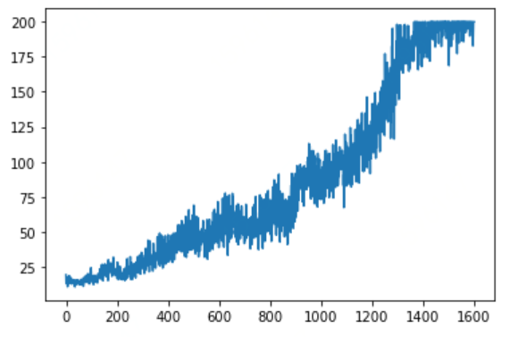
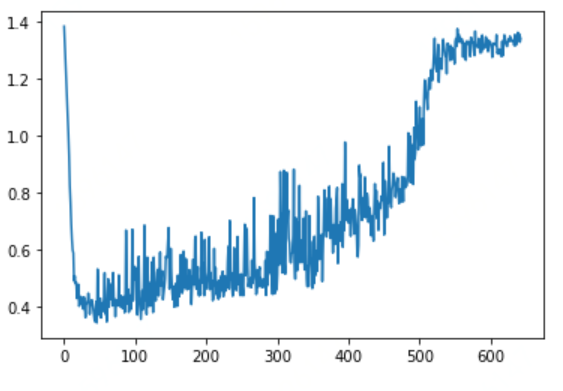
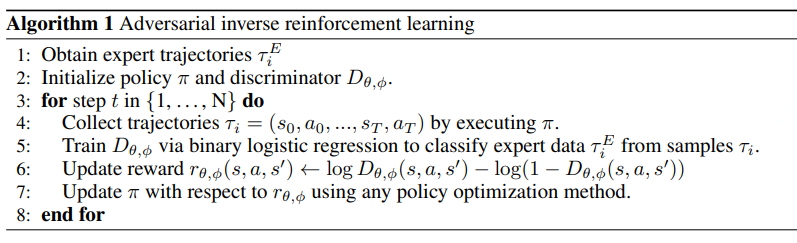

## Airl algo 
- trajectory/ storage trajectories of expert like (s,a)

## Useage
```
python run.py

```

## Result

rewards:



dscriminator loss:



## Algo



### Reference paper

[learning robust rewards with adversarial inverse reinforcement learning](https://arxiv.org/pdf/1710.11248.pdf)

